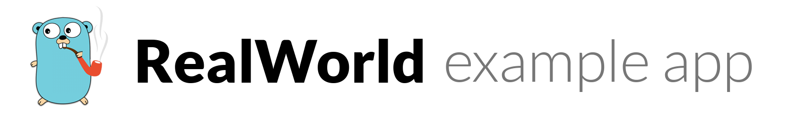

# 


[](https://travis-ci.org/wangzitian0/golang-gin-realworld-example-app)
[](https://codecov.io/gh/wangzitian0/golang-gin-realworld-example-app)
[](https://github.com/gothinkster/golang-gin-realworld-example-app/blob/master/LICENSE)
[](https://godoc.org/github.com/gothinkster/golang-gin-realworld-example-app)

> ### Golang/Gin codebase containing real world examples (CRUD, auth, advanced patterns, etc) that adheres to the [RealWorld](https://github.com/gothinkster/realworld) spec and API.


This codebase was created to todolist built with **Golang/Gin** with CRUD .


# Directory structure
```
.
├── gorm.db
├── main.go


# Getting started

## Install Golang

Make sure you have Go 1.13 or higher installed.

https://golang.org/doc/install

## Environment Config

Set-up the standard Go environment variables according to latest guidance (see https://golang.org/doc/install#install).


## Install Dependencies
From the project root, run:
```
go build ./...
go test ./...
go mod tidy

depending on whether you want to see test coverage and how verbose the output you want.

## Todo
- run docker 
- open database
- connect with port 3000
- run as port 3600
- set up environment with name db has url database
